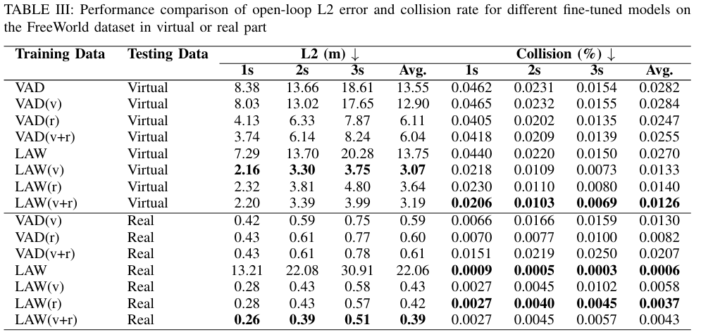

## Introduction
Most existing end-to-end (E2E) autonomous driving algorithms are designed for **standard vehicles** in structured traffic scenarios.  
However, these methods rarely explore **robot navigation in unstructured environments** such as:

- Auxiliary roads  
- Campus paths  
- Indoor areas  

This repository introduces **FreeWorld Dataset**, the first dataset specifically targeting **E2E robot navigation in unstructured scenarios**.  
The dataset is built through two complementary pipelines:

- **Real-world data collection** using mobile robots  
- **Synthetic data generation** with a Unity-based simulator  

We also provide **benchmark baselines** by fine-tuning two efficient E2E autonomous driving models:

- **VAD**  
- **LAW**

### Key Highlights
- 📀 First dataset for unstructured robot navigation  
- 🤖 Supports both **real** and **synthetic** data pipelines  
- 🧪 Benchmark results show improved performance after fine-tuning on FreeWorld  
- 🚚 Targeted towards **logistics and service robots** in real-world unstructured environments  

By releasing both the dataset and baseline models, this project serves as a foundation for advancing **vision-based E2E navigation technology**.

## Paper
Our research paper detailing the FreeAD system, dataset, and experimental results is available on [arXiv](https://arxiv.org/abs/2503.12180).

## Dataset
We modified some APIs from the nuScenes dataset to enhance flexibility and support a wider variety of data and map scenarios. The modified code has been localized and named FreeWorld.
The [FreeWorld Dataset(Real Part)](https://huggingface.co/datasets/doraemon6666/FreeWorld) is available for access.

The [FreeAskWorld Dataset(Virtual Part)](https://huggingface.co/datasets/doraemonILoveYou/FreeAskWorld) is available for access.

## Model
We conducted fine-tuning experiments on both virtual and real datasets to evaluate our models. Three dataset configurations were considered:

- **Virtual-only (V)**
- **Real-only (R)**
- **Combined virtual + real (V+R)**

### LAW (Perception-Free) Model

| Dataset | Fine-Tuning Setup |
|---------|-----------------|
| V       | Fine-tuned for 3 epochs on the virtual dataset. |
| R       | Fine-tuned for 1 epoch on the real dataset. |
| V+R     | First fine-tuned for 3 epochs on the virtual dataset, followed by 1 epoch on the real dataset. |

### VAD-Base Model

Fine-tuning was performed in two stages:

| Dataset | Stage 1 | Stage 2 |
|---------|---------|---------|
| V       | Fine-tuned for 3 epochs on the virtual dataset | Fine-tuned for 1 epoch |
| R       | Fine-tuned for 1 epoch on the real dataset | Fine-tuned for 1 epoch |
| V+R     | Fine-tuned for 3 epochs on the virtual dataset and 1 epoch on the real dataset | Fine-tuned for 1 epoch on each dataset |

The models is available on [Hugging Face](https://huggingface.co/doraemonILoveYou/FreeAD). -->


## Results

### Map Modeling Results on FreeWorld
This table presents a comparison between VAD-Tiny and VAD-Base using the Boundary + Divider map modeling strategy on the Full Warehouse map. This map structure closely aligns with the nuScenes map definition, providing a comprehensive evaluation in an open-loop scenario.
| **Method**  | **L2 (m) 1s ↓** | **L2 (m) 2s ↓** | **L2 (m) 3s ↓** | **L2 (m) Avg. ↓** | **AP Divider ↑** | **AP Boundary ↑** | **FPS** | **Collision (%) ↓** |
|:------------|:----------------:|:----------------:|:----------------:|:--------------------:|:--------------------:|:--------------------:|:-------:|:---------------------:|
| VAD-Tiny     | **1.772**         | **3.291**         | **5.008**         | **3.357**             | **0.004**             | 0.000                 | **7.6** | **0.00**              |
| VAD-Base     | 3.296             | 5.779             | 8.429             | 5.835                 | 0.001                 | 0.000                 | 4.6     | 0.00                   |

**Note:** AP Divider and AP Boundary are computed with a threshold of 1.5.  


### Open-loop Results and Sim2Real on FreeWorld
<!-- Open-loop Results on FreeWorld: Comparison of VAD-Tiny, VAD-Base, and FT-VAD under the "Divider Only" map modeling strategy. ADE and FDE represent pedestrian motion prediction errors.
**ADE** and **FDE** represent pedestrian motion prediction errors.   -->

- Open-loop planning results on [FreeWorld(Real Part)](https://huggingface.co/datasets/doraemon6666/FreeWorld). and [FreeAskWorld Dataset(Virtual Part)](https://huggingface.co/datasets/doraemonILoveYou/FreeAskWorld)



<!-- | **Method**  | **L2 (m) 1s ↓** | **L2 (m) 2s ↓** | **L2 (m) 3s ↓** | **Avg. ↓** | **AP divider ↑** | **FPS ↑** | **Collision (Avg. %) ↓** | **ADE ↓** | **FDE ↓** |
|:------------|:----------------:|:----------------:|:----------------:|:------------:|:------------------:|:-----------:|:---------------------------:|:------------:|:------------:|
| VAD-Tiny     | 0.891            | 1.600            | 2.449            | 1.647         | 0.000               | **8.7**     | 0.00                         | 2.848         | 3.294         |
| VAD-Base     | 0.499            | 0.759            | 1.040            | 0.766         | 0.001               | 5.0          | 0.00                         | 2.089         | 2.917         |
| **FT-VAD**   | **0.421**        | **0.596**        | **0.760**        | **0.592**     | **0.567**            | 5.0          | 0.00                         | **1.432**     | **2.319**     |

> **Note:** AP divider is computed with a threshold of 1.5. -->

<!-- ### Open-loop Results on nuScenes
- Open-loop Planning Results on [nuScenes](https://github.com/nutonomy/nuscenes-devkit)

| **Method**  | **L2 (m) 1s ↓** | **L2 (m) 2s ↓** | **L2 (m) 3s ↓** | **Col. (%) 1s ↓** | **Col. (%) 2s ↓** | **Col. (%) 3s ↓** |
|:------------|:----------------:|:----------------:|:----------------:|:--------------------:|:--------------------:|:--------------------:|
| VAD-Tiny     | 0.46             | 0.76             | 1.12             | 0.21                 | 0.35                 | 0.58                 |
| VAD-Base     | **0.41**         | **0.70**         | **1.05**         | 0.07                 | 0.17                 | 0.41                 |
| **FT-VAD**   | 2.02             | 3.24             | 4.38             | **0.00**             | **0.00019**          | **0.00016**          | -->

## Plugin
Help you use FreeAskWorld Dataset with nuScenes-like API.
[FreeAskWorldDataset](https://github.com/doraemonaaaa/FreeAskWorldDataset)

Help you use FreeWorld Dataset with nuScenes-like API.
[FreeWorldDataset](https://github.com/doraemonaaaa/FreeWorldDataset)

## Getting Started
- [Installation](docs/install.md)
- [Prepare Dataset](docs/prepare_dataset.md)
- [Train and Eval](docs/train_eval.md)
- [Visualization](docs/visualization.md)

## Qualitative Results
FreeAD results


VAD results


 **Note:** We found that the VAD exaggerated the predicted distance of map objects, and the 3D box detection performance was average.

## Contact
If you have any questions or suggestions about this repo, please feel free to contact us (yuhangpeng65@gmail.com).

## Citation
If you find FreeAD useful in your research or applications, please consider giving us a star &#127775; and citing it by the following BibTeX entry.

```BibTeX
@article{peng2025bench2freead,
  title={Bench2FreeAD: A Benchmark for Vision-based End-to-end Navigation in Unstructured Robotic Environments},
  author={Peng, Yuhang and Wang, Sidong and Yang, Jihaoyu and Li, Shilong and Wang, Han and Gong, Jiangtao},
  journal={arXiv preprint arXiv:2503.12180},
  year={2025}
}
```

## License
All code in this repository is under the [Apache License 2.0](https://www.apache.org/licenses/LICENSE-2.0).

## Acknowledgement
FreeAD is based on the following projects: [VAD](https://github.com/hustvl/VAD), [LAW](https://github.com/BraveGroup/LAW) and [MapTR](https://github.com/hustvl/MapTR). Many thanks for their excellent contributions to the community.